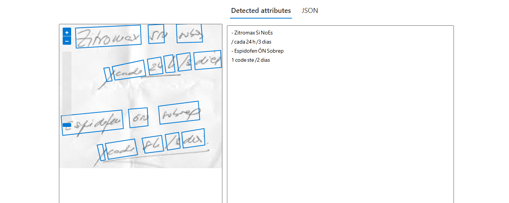
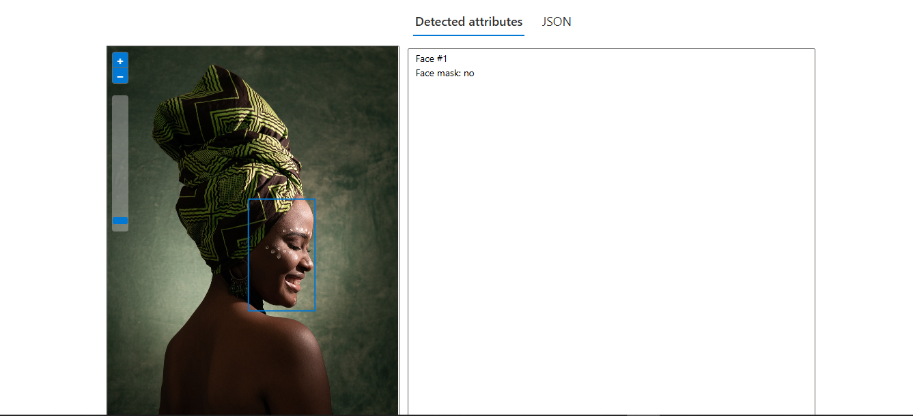
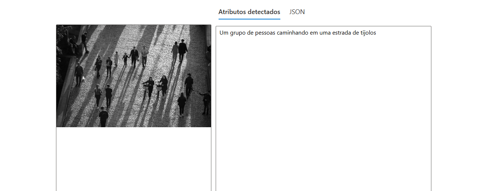

# Desafio 2 - Bootcamp Microsoft Fundamentos AI

## Reconhecimento Facial e transformação de imagens em Dados no Azure ML

## Objetivo

Explorar o Azure AI Visual para reconhecimento de **imagens** e **texto** utilizando ferramentas como OCR e Vision Studio.

## Estrutura do Projeto

- Pasta `assets` contendo a pasta `prints` que armazenar os prints dos testes.
- Pasta `inputs` criada para armazenar as imagens de teste.
- Pasta `outputs` criada para armazenar os Jsons(as saidas de testes).

---

## Passo a Passo

**Acesse o portal Azure e crie um recurso no Azure AI Service**:

- Navegue para **Azure AI Service** e clique em **Criar Recurso**.
- Escolha ou crie um **Grupo de Recursos**.
- Nome: Insira um nome exclusivo.
- Região: `East US`.
- Preço: `Standard 50`.
- **Aceitação dos Termos**: Marque a opção para aceitar os termos.
- Clique em **Criar**.

- Após a criação, clique em **Ir para Recurso**.
- Dentro do recurso, selecione a opção **Vision**.
- Clique em **Go to Documentation** para acessar a área de teste.

---

### Testar Reconhecimento Visual

1. Acesse a funcionalidade de **Optical Character Recognition (OCR)**:.
2. Teste as funções:

   - **OCR (Reconhecimento Óptico de Caracteres):** Extraia texto das imagens.
     

   - **Análise de Face:** Detecte rostos em imagens.  
     

   - **Adicionar legendas às imagens:** Gera uma frase legível por humanos que descreva o conteúdo de uma imagem.
     

3. Faça upload das imagens da pasta `inputs` e analise os resultados.

---

## Resultados

- Os testes geraram arquivos JSON com o texto e dados extraídos.
- As imagens analisadas demonstraram alta precisão nos modelos de reconhecimento.

---

## Ferramentas Utilizadas

- **Azure AI Visual** para visão computacional.
- **OCR** para transformar texto de imagens em texto pesquisável.
- **JSON** para armazenar os resultados.
